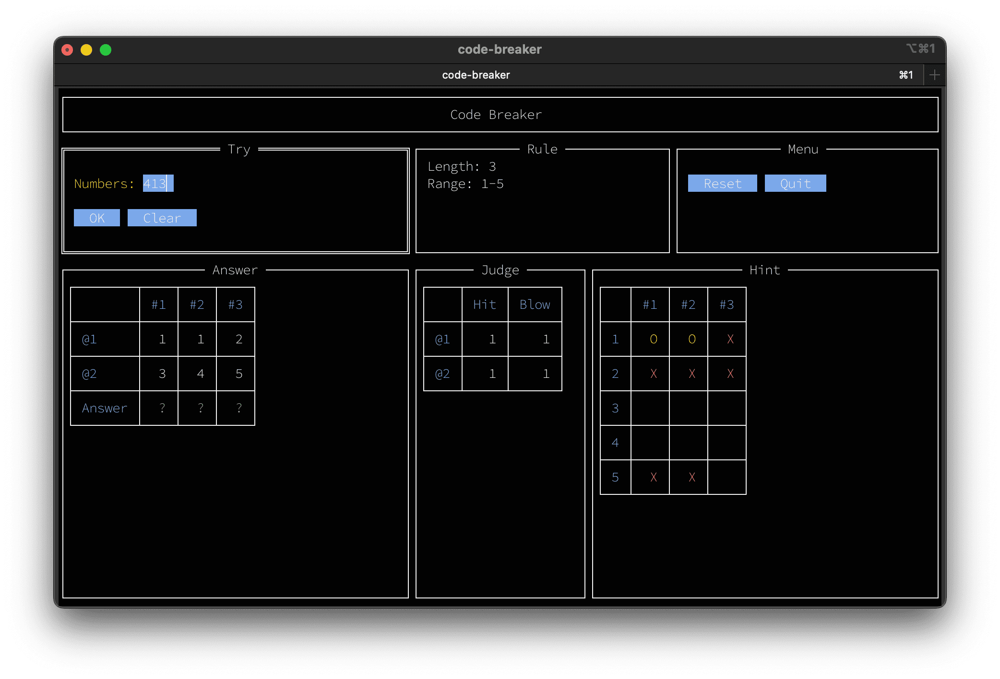

# コードブレイカー

ナマステ！

女神転生シリーズのミニゲーム「コードブレイカー」を TUI で再現しました。

「ヒット＆ブロー」や「マスターマインド」とも呼ばれるあのゲームです。



## インストール

```console
$ go install github.com/quickguard-oss/code-breaker@latest
```

## 実行方法

```console
$ code-breaker [-l <digits>] [-n <max-number>]
```

数列の長さと使用する数字は引数で変更できます。

```txt
  -l int
        Number of digits. [1-9] (default 3)
  -n int
        Maximum number to be used, ranging from 1 up to this value. [1-9] (default 5)
```

## ルール

* 9回まで解答を入力できます。    
    9回以内に正解を当てないとチャレンジ失敗です。
* 正解はすべて異なる数字です。    
    ただし、解答では同じ数字を重複して入力できます。    
    正解が `123` のときに解答として `111` を入力した場合、判定は `H=1/B=2` となります。
* ヒント表の凡例は以下のとおりです。    
    | シンボル | 意味 |
    | --- | --- |
    | `@` | ヒット。その数字はその桁で確定した。 |
    | `O` | 桁は不明だが、その数字は正解に含まれる。 |
    | `X` | その数字はその桁には存在しない。 |
    | (空白) | 未確定。判断するには情報が足りない。 |
